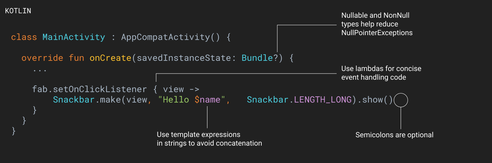

# Migración de Java a Kotlin

Kotlin es un lenaguaje que busca a ayudarnos a tener una curva de aprendizaje corta y rápida.
Ventajas de Kotlin sobre Java.

## Kotlin - Java

- Funciona sobre la JVM (Java Virtual Machine)
- Compilado a código de Javascript
- Basado en...
  - Java
  - Scala (Java Avanzado)
  - Groovy (Manejo de paquetes y proyectos grandes)
  - C#
- Android (Desarrollo Nativo)
  - C++
  - Java
  - Kotlin
- Kotlin
  - Curva de aprendizaje corta
  - Menos líneas de código
  - Seguridad frente a nulos
    - `val x: Int = null` (No podemos asignar nulos si no lo indicamos)
    - `val x:Int? = null`
  - Interfaces pueden tener código
  - POJO reemplzado por _**clase dato**_

En [JetBrains](https://www.jetbrains.com/es-es/idea/download/) podemos descargar IntelliJ IDEA para poder utilizar este entorno para programar en JAVA o usar Kotlin

## Kotlin en Android

Kotlin aparece como una nueva apuesta dentro del desarrollo como un lenguaje moderno, rápido, flexible y, sobre todo, pensando en la productividad y conceptos sencillos. En el desarrollo de aplicaciones Android están cambiando las reglas y Kotlin es la base de las nuevas reglas que debemos de entender si es que nos interesa mantener los conocimientos actualizados a la velocidad de los últimos cambios. Kotlin no solamente es un nuevo lenguaje, es un cambio en la filosofía del desarrollo por las bases de su naturaleza y su funcionamiento. Kotlin es una gran apuesta para cualquier desarrollador de aplicaciones móviles.

En la opción de plugin podemos instalar **Kotlin** en Android Studio para poder usar el lenguaje para programar aplicaciones Android.

En Android podemos usar código combinado, usando Java y Kotlin

Para ello, es recomendado usar paquetes donde se especifique el el lenguaje utilizado.

- **javacode**
- **kotlincode**

Es buena idea no tener los lenguajes combinados en el mismo paquete.

## Convertir código de Java a Kotlin

Para usar kotlin con android Studio, en build.gradle se crean algunos plugins para dar soporte. En la Version de Android Studio

```
apply plugin: 'kotlin-android'
apply plugin: 'kotlin-android-extensions'
```

## Tipos e datos en Kotlin

En Kotlin todo es un objeto, a diferencia de Java no tiene datos básicos o primitivos.

- **Inferencia de tipo** Kotlin infiere qué tipo de da es dependiendo de la asignacion

- **Tipos de datos**
  - **`var x = 10`** Lo toma como un número
  - **Entero** `var num: Int = 10`
  - **Unit** `var num: Unit = 1` Funciona de manera similar a trabajar con void en Java (Pero es un objeto) -**Byte** `var num: Byte`
  - **Short** `var num: Short = 7`
  - **Char** `var num: Char = 'c'`
  - **String** `var num: String = "Rajaleña"`

Para definir una constante en Kotlin, se usa **val** en lugar de **var**

- **var** Variable
- **val** Constante (Inmutable)

Los comentarios se hacen igual que en Java

- De una línea `// Una sola línea`
- Multilínea `/* Comentario de varias líneas */`

Las condicionales en Kotlin funciona igual que en los otros lenguajes de programación

El for se comporta como un **for each**



> Recordar importar el soporte para CardView y para RecyclerView en Android y siempre debe coincidir con la versión del AppCompact

Para más información visitar [Cómo crear una lista con RecyclerView ](https://developer.android.com/guide/topics/ui/layout/recyclerview)

Cómo ahora con **AndroidX** las bibliotecas cambia al usar las dependencias, para ello debemos consultar en [Bibliotecas de JetPack](https://developer.android.com/jetpack/androidx/releases/cardview)

- :see: Ver [Android Jetpack](https://developer.android.com/jetpack)
- [Cómo iniciar otra actividad](https://developer.android.com/training/basics/firstapp/starting-activity?hl=es)
